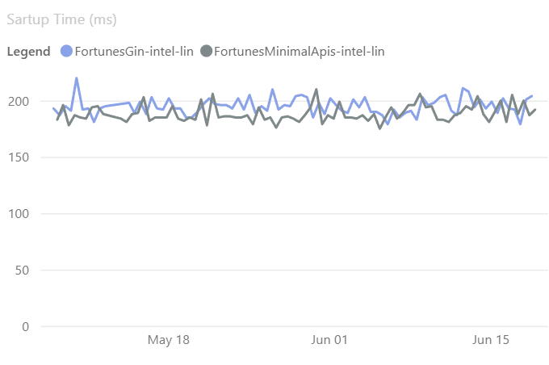

# Project
Source code examples for the Server-Driven web apps with htmx book but with C# instead of JavaScript on the backend.

Book: https://pragprog.com/titles/mvhtmx/server-driven-web-apps-with-htmx/
Htmx: https://htmx.org/
Minimal Api: https://learn.microsoft.com/en-us/aspnet/core/fundamentals/minimal-apis/overview?view=aspnetcore-9.0

# Chapter 01 - Jumping In
The first chapter has two simple projects which I implemented in a single one. I'm using C# Minimal Api for serving the requests/static assets and Razor as the HTML template.
    
- Minimal Api has the advantage of being really easy to implement and requires quite little code.
    
- Razor as the HTML engine is really powerfull because it allows me to split code into components that can be used in other places and it's statically typed which makes my life way easier.

# Chapter 02 - Exploring Server Options
This chapter doesn't really produce any artifact, that's why there's no "chapter-02" folder. Instead, it lists some characteristics the author considers would be a good tech stack for using with Htmx. The list is below and I explain my choices:

#### 1. The server starts fast — typically less than one second
That's defnitely the case for Minimal Api. Comparing to the Go language with the Gin framework, which is a really fast competitor, we can see that the Startup Time (ms) is quite similar:



You can see more at https://aka.ms/aspnet/benchmarks, open the "Benchmarks" tab and select the scenarios to compare.

#### 2. The server can automatically restart after source code changes are detected
Thank to .NET Hot Reaload that's possible: https://learn.microsoft.com/en-us/aspnet/core/test/hot-reload?view=aspnetcore-9.0

#### 3. It’s easy to define new endpoints for any HTTP verb and URL pattern
That's why I choose ASP.NET Minimal Api, it's super easy to define new endpoints. Below is an entire application with a "/" endpoint returning a string:

```c#
var builder = WebApplication.CreateBuilder(args);
var app = builder.Build();

app.MapGet("/", () => "Hello World!");

app.Run();
```

#### 4. It’s easy to specify type checking and validation of request data
ASP.NET data/model binding has a wide variety of sources which includes routes, query, header, and more.

Regading validation, although Minimal Api does not support validation with [DataAnnotation] yet, it's supper easy to add another library, for example FluentValidation. [DataAnnotation] validation is going to be release with .NET 10 (https://github.com/dotnet/aspnetcore/issues/46349).

#### 5. It’s easy to extract data from an HTTP request
Another ✅! Just like item 4, it's super easy to use model/data binding and also you can easy have access to HttpContext, where you can have access to headers, body etc.

#### 6. There is good HTML templating support
In .NET apps the best HTML templating tool is know as [Razor](https://learn.microsoft.com/en-us/aspnet/core/mvc/views/razor?view=aspnetcore-9.0). My opinion is that it's pretty good choice as you can see in this project, you can mix C# and HTML pretty easily, mixing the benefits of the C# language with HTML. In this case we are using more specifically the [Razor components](https://learn.microsoft.com/en-us/aspnet/core/blazor/components/?view=aspnetcore-9.0).

#### 7. Your preferred code editor provides syntax highlighting and some level of validation
All the tools I mentioned are very well supported both on Visual Studio as Visual Studio Code, which gives you interesting options in order to develop your application, either on Windows, Mac or Linux.  